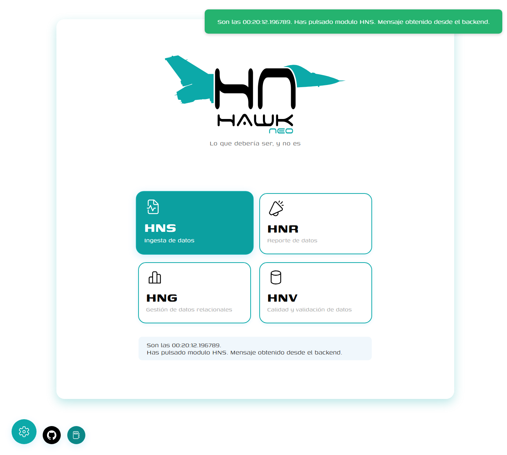

<div align="center">
  
</div>

# 
HAWKneo es una aplicación web moderna que combina un frontend en Angular y un backend en FastAPI (Python) para la ingesta, reporte y futuros procesos de datos de referencia. El objetivo es ofrecer una plataforma visual y ágil para el seguimiento y la calidad de datos.

## Tabla de Contenidos
- [Descripción](#descripción)
- [Estructura del Proyecto](#estructura-del-proyecto)
- [Características de la UI](#características-de-la-ui)
- [Instalación y Primeros Pasos](#instalación-y-primeros-pasos)
- [Arranque Rápido](#arranque-rápido)
- [Dependencias](#dependencias)
- [Licencia](#licencia)

## Descripción
HAWKNeo permite gestionar diferentes flujos de datos de referencia a partir de una serie de módulos (HNS, HNR, HNG, HNQ), proporcionando una interfaz adaptada a los tiempos que corren.

Este sistema está especialmente diseñado para la gestión y monitorización del ciclo de vida de datos de piezas de aeronaves, abarcando desde la recepción inicial de los datos, su validación y enriquecimiento, hasta la trazabilidad completa de componentes críticos en la industria aeronáutica. 

HAWKNeo facilita asegurar la calidad y la integridad de la información asociada a cada pieza, permitiendo un control exhaustivo y cumplimiento normativo en entornos industriales altamente regulados.

## Estructura del Proyecto
- `frontend/`: Aplicación Angular (UI principal)
- `backend/`: API REST en FastAPI (Python)
- `scripts/`: Scripts para arrancar los servicios de frontend y backend




## Características de la UI

La interfaz de usuario de HAWKneo ha sido diseñada para ofrecer una experiencia moderna y eficiente:

- **Tarjeta Principal**: Amplia tarjeta central de 1100px de ancho que proporciona espacio adecuado para todos los componentes.
- **Sistema de Notificaciones**: Notificaciones toast integradas que aparecen en la esquina superior derecha de la tarjeta principal.
- **Navegación por Módulos**: Barra lateral de navegación de 78px con iconos ampliados y mejor espaciado.
- **Campos de Formulario Mejorados**: Desplegables con estilos personalizados que muestran los placeholders en gris y las opciones en negro.
- **Efectos de Interacción**: Hover en colores primarios para todos los elementos interactivos.
- **Botones de Acción**: Botones flotantes (ajustes, GitHub, documentación) posicionados debajo de la tarjeta principal.
- **Diseño Responsive**: Interfaz adaptable que mantiene la coherencia visual en diferentes resoluciones.

## Instalación y Primeros Pasos
### Requisitos
- Angular CLI (`npm install -g @angular/cli`)
- Python 3.8+

### Instalación Frontend
```bash
cd frontend
npm install
```

### Instalación Backend
```bash
cd backend
pip install -r requirements.txt
```

## Arranque Rápido
### Arrancar el Backend
Puedes usar el script en PowerShell:
```bash
cd scripts
pwsh run_backend.ps1
```
O manualmente:
```bash
cd backend
uvicorn app.main:app --reload --host 0.0.0.0 --port 8000
```

### Arrancar el Frontend
Puedes usar el script en PowerShell:
```bash
cd scripts
pwsh run_frontend.ps1
```
O manualmente:
```bash
cd frontend
npx ng serve HAWKneo --open
```

## Dependencias Principales
- **Frontend:** Angular 19
- **Backend:** FastAPI, Uvicorn


## Licencia
Licencia de que?
