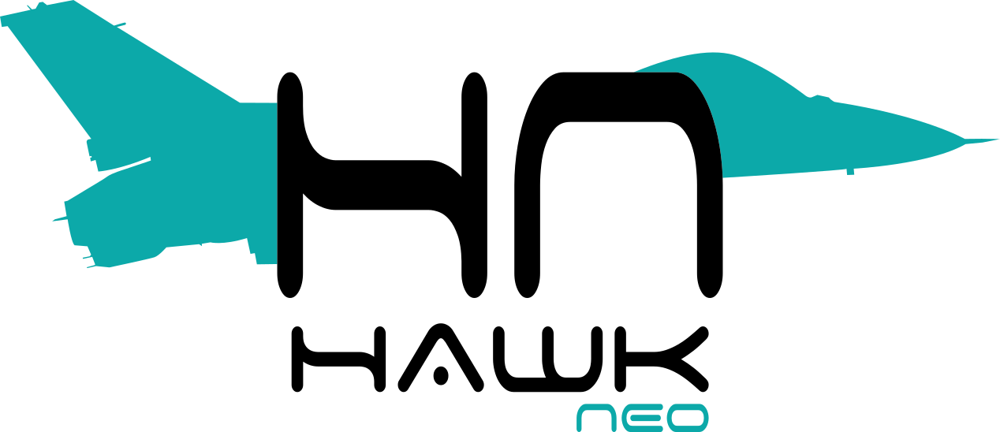
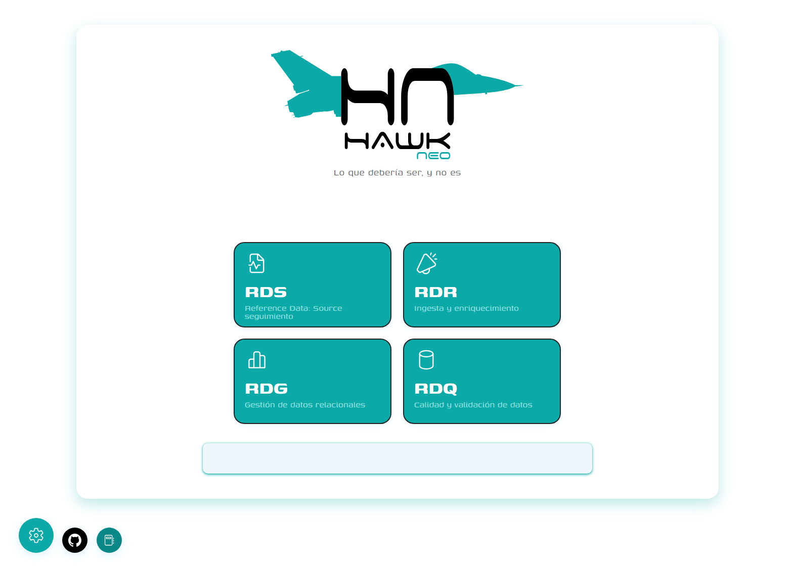

<div align="center">
  
</div>


HAWKNeo es una aplicación web moderna que combina un frontend en Angular y un backend en FastAPI (Python) para la gestión, ingesta, enriquecimiento y validación de datos de referencia. El objetivo es ofrecer una plataforma visual y ágil para el seguimiento y la calidad de datos.

## Tabla de Contenidos
- [Descripción](#descripción)
- [Estructura del Proyecto](#estructura-del-proyecto)
- [Instalación y Primeros Pasos](#instalación-y-primeros-pasos)
- [Arranque Rápido](#arranque-rápido)
- [Dependencias](#dependencias)
- [Capturas de Pantalla](#capturas-de-pantalla)
- [Licencia](#licencia)

## Descripción
HAWKNeo permite visualizar y gestionar diferentes flujos de datos de referencia (RDS, RDR, RDG, RDQ), proporcionando una interfaz moderna y responsiva.





## Estructura del Proyecto
- `frontend/`: Aplicación Angular (UI principal)
- `backend/`: API REST en FastAPI (Python)
- `scripts/`: Scripts para arrancar los servicios de frontend y backend

## Instalación y Primeros Pasos
### Requisitos
- Node.js 18+
- Angular CLI (`npm install -g @angular/cli`)
- Python 3.8+

### Instalación Frontend
```bash
cd frontend
npm install
```

### Instalación Backend
```bash
cd backend
pip install -r requirements.txt
```

## Arranque Rápido
### Arrancar el Backend
Puedes usar el script en PowerShell:
```bash
cd scripts
pwsh run_backend.ps1
```
O manualmente:
```bash
cd backend
uvicorn app.main:app --reload --host 0.0.0.0 --port 8000
```

### Arrancar el Frontend
Puedes usar el script en PowerShell:
```bash
cd scripts
pwsh run_frontend.ps1
```
O manualmente:
```bash
cd frontend
npx ng serve HAWKneo --open
```

## Dependencias Principales
- **Frontend:** Angular 19, Kendo UI, RxJS
- **Backend:** FastAPI, Uvicorn


## Licencia
[MIT](LICENSE)
